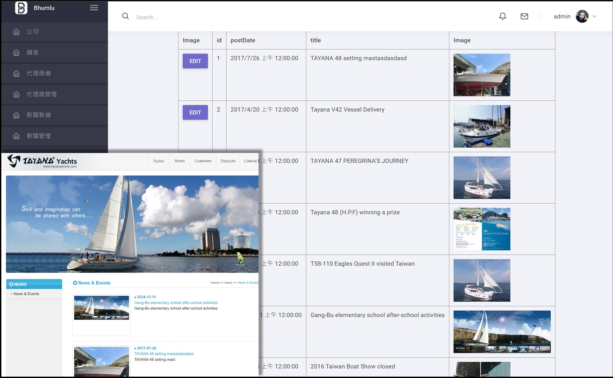
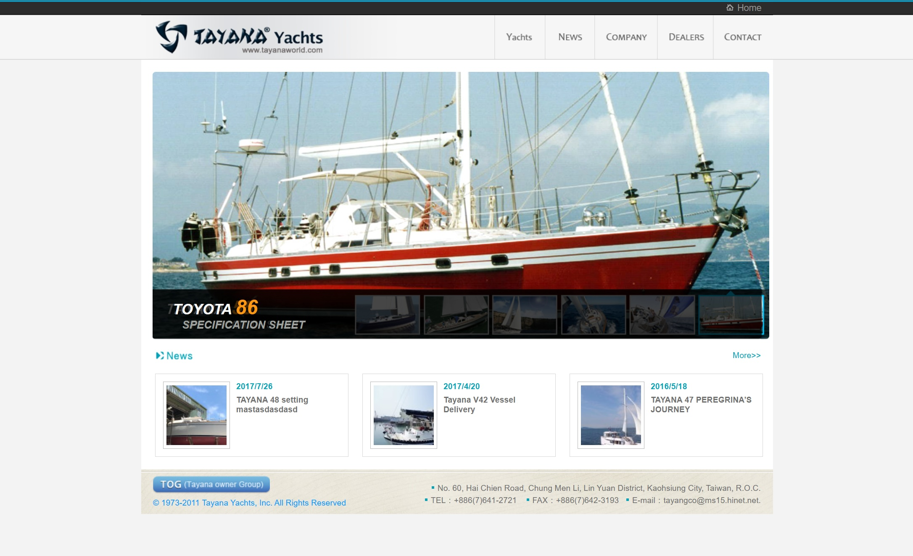
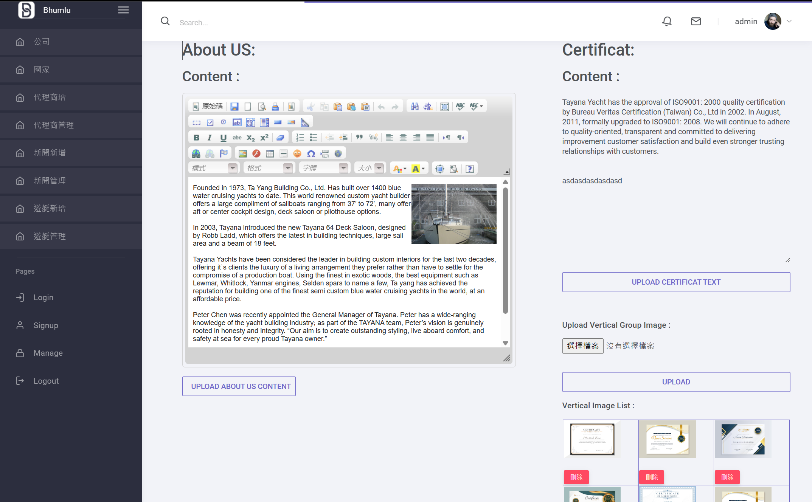
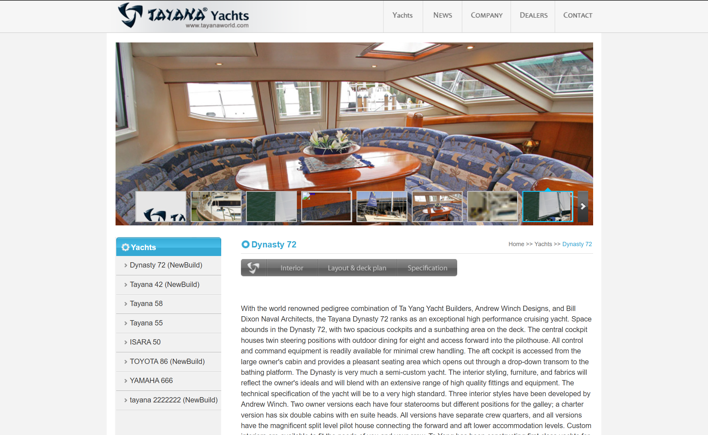
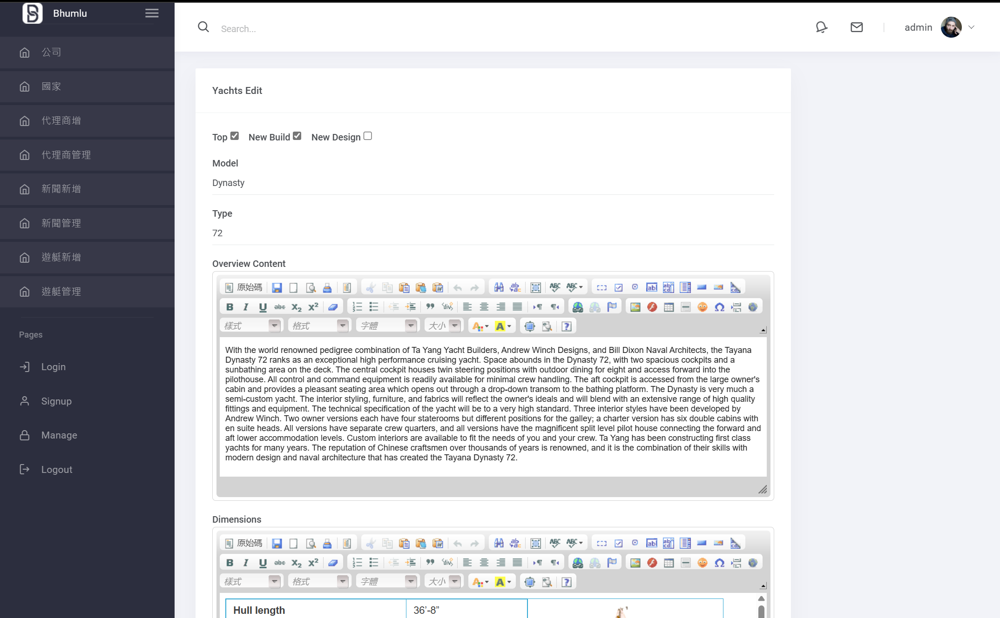

<h1 align="center">TAYANA Yacht ｜後台管理系統</h1>

 

---

【獨立專案】

遊艇後台專案主要負責後端以及後台系統開發，後台需具備完整CRUD及管理功能

【功能介紹】

**前端**：
* 展示遊艇輪播圖：以輪播形式展示上市遊艇
* 最新消息：具日期排列和置頂消息
* 代理商資訊：展示各國代理商和聯絡方式
* 關於我們：提供遊艇公司相關資訊
* 聯絡我：通過填寫表格的方式自動發送Mail(Google)，包含人機驗證(Captcha)

**後端**：

各前端頁面的CRUD功能
管理船隻/代理商/最新消息內容以及置頂項目

【心得回顧】

這是在培訓營學習WebForm的專案，發開約三週。
開發期間需要考量使用者體驗去建立合理使用的後台頁面，並同時要去思索資料表的建置，由於在這個專案中有大量使用到ADO.NET
內部使用參數化查尋進行資料填寫避免SQL injection狀況，對於網頁安全多了一份新的認知。

【使用技術】

* ASP.NET WebForm：建立後台系統主要架構，具備完整CRUD功能
* MSSQL：建立資料庫及資料表關聯性
* Jquery：產生網頁前端輪播圖效果
* Bootstrap :套用並規劃後台版型

## 專案截圖：

＊ 首頁：

 

＊ 關於我-後台介面：

 

* 遊艇規格介紹：

 

* 遊艇修改頁面：
  

   
  

  ---
